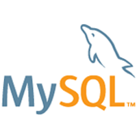

# Nosso projeto com documentação


[](https://www.instagram.com)

 escrevendo minha **documentação** para estudar em *itálico* um 
pouco de ***Markdown*** 

# Título do projeto
## Estudo do projeto
### Trabalhando com **Documentação** 
* Primeiro
   * Primeiro.primeiro
   * Primeiro.Segundo
1. Linguagens de Script
   * JavaScript
   * ActionScript
   * VBScript
2. Sistemas Operacionais
   - 2.1. Microsoft Windows
   - 2.2. Linux
   - 2.3. MacOS

``` javascript
    var nome = "Pedro"
    nome = prompt("Digite o seu nome")
    if(nome == ""){
          alert("Mensagem qualquer");
    }
```
### Abaixo o código de um arquivo C++

```c++
    #include <iostream>
    using std::cout;
    using std::cin;
    using std::endl;

    int main(){
        cout << "Olá. Seja bem-vindo" << endl;
        return 0;
    }
```

## Veja a tela gerada com o códico acima


## Veja o resultado do estudo Markdown


### Tarefas 

- [X] Montar o computador
- [X] Formatar o computador
- [X] Preparar o pen drive de boot 
- [] Instalar o sistema operacional
- [] Verificar a instalação dos drivers
    
### Sistema e Empresas 

Empresa | Sistemas | Versao
--------|----------|--------
Microsoft|Windows  | 11
Apple  | MacOS  | 10.14
Ubuntu | Focal | 2004
RedHat | Enterprise | 8


### Application and Data (Aplicação e data) 

JQuery|Python|NodeJS|React
------|------|------|------
||| 
Java| Mysql| PostgreSQP | MongoDB
|||